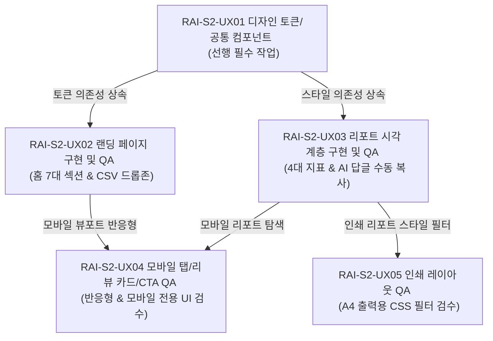

# 📋 S1_DEX_DEVELOPMENT_WBS.md v0.3 (S2 덱스 병렬 개발 작업 분해 WBS)

본 문서는 `RAI-S1-ST08 — 덱스 병렬 개발 작업 분해표 작성` 백로그의 최종 산출물입니다. 스프린트 2(S2) 단계에서 개발자 덱스(Dex)가 작업을 병렬 수행 가능한 단위로 분할하여 개발 범위를 확인할 수 있도록, 각 세부 작업의 목적, 입력, 수정 범위, 완료 기준, QA 검수 기준 및 금지 표현을 쪼개어 수립한 공식 WBS 기획 문서입니다.

> [!WARNING]
> **주의**: 본 산출물은 실제 앱 코드 구현이나 덱스 개발 시작, GitHub 브랜치 생성, PR 작성이 아닙니다. 덱스가 S2 개발 범위 확인 시 참고할 작업 분해표를 준비하는 순수 기획적 설계 문서이므로, 본 단계에서 실제 scaffold 생성, 앱 코드 작성, 실제 GitHub 브랜치 생성 및 PR 발급은 수행하지 않습니다.

---

## 1. 문서 목적

* **S2 개발 작업 분해 기준**: 덱스가 S2 개발에서 마크업, CSS 스타일, 로직 단위를 작게 나누어 충돌 없이 병렬로 작업을 진척할 수 있도록 분해 단위를 설계합니다.
* **병렬 작업 가능 범위 정리**: 선행 작업(토큰/레이아웃)과 병렬 작업(랜딩/리포트), 그리고 후속 연동 작업(모바일/인쇄)의 선후 의존성 구조를 규정합니다.
* **독립적 이해 기준 제공**: 덱스가 각 세부 티켓을 확인할 때 타 태스크를 참조하지 않고도 목적, 입력 데이터, 완료 조건(Acceptance Criteria)을 즉시 파악하고 개발 준비 범위를 확인할 수 있도록 돕습니다.
* **실제 개발 실행 전 기획용 WBS 명시**: 덱스에게 일방적인 구현 실행을 지시하는 용도가 아니라, 빌/라이언의 검수 게이트키핑을 통과하기 위해 WBS 티켓들의 품질 통제선을 사전에 긋기 위함입니다.

---

## 2. 전체 의존성 맵

S2 UX/UI 개발의 흐름과 선후 종속 관계는 다음과 같습니다. 덱스는 반드시 이 흐름을 준수하여 병렬 개발 계획을 수립해야 합니다.

* **의존성 규칙**:
  1. `RAI-S2-UX01` (디자인 토큰/공통 컴포넌트)은 최우선적으로 완료되어야 하는 **선행 필수 작업**입니다.
  2. `RAI-S2-UX02` (랜딩/입력)와 `RAI-S2-UX03` (리포트)은 `UX01` 통과 후 **동시에 병렬 수행** 가능합니다.
  3. `RAI-S2-UX04` (모바일 반응형)는 `UX02`와 `UX03`이 구현된 후, 모바일 뷰포트 품질 검수로 이관 연결됩니다.
  4. `RAI-S2-UX05` (인쇄 레이아웃)는 `UX03` 리포트 시각 계층이 잡힌 후, 인쇄 CSS 마진 및 필터링 품질 검수로 이관 연결됩니다.

---

## 3. 14개 하위 태스크 상세 WBS

### 3.1. RAI-S2-UX01 (디자인 토큰 및 공통 컴포넌트)

#### 3.1.1. [RAI-S2-UX01-01] 디자인 토큰 변수 정의
* **목적**: 유료 리포트에 걸맞은 세련된 브랜드 테마 구축을 위해 공통 CSS 커스텀 프로퍼티를 통합 수립합니다.
* **입력 파일/데이터**: `S1_DEX_UX_UI_TASK_SPEC.md` v0.3 내 4.1절 디자인 토큰 세부 규격.
* **수정 범위**: `index.css` (CSS `:root` 영역).
* **완료 기준**:
  1. `Primary` (#1D4ED8), `Background` (#F8FAFC), `Card Background` (#FFFFFF), `Border` (#E2E8F0), `Text Primary` (#0F172A), `Text Secondary` (#64748B), `Success` (#16A34A), `Warning` (#F97316), `Danger` (#DC2626), `Kakao CTA` (#FEE500) 변수 정의 완료.
  2. 타이포그래피 폰트 패밀리 `Pretendard` 폴백 지정 및 `H1` (28px/bold), `H2` (20px/semibold), `Body` (15px/regular), `Caption` (12px/regular) 계층화 완료.
  3. 라운드 변수 `border-radius: 12px` (대형 카드용) 및 `border-radius: 8px` (버튼/인풋용) 지정 완료.
* **QA 기준**: 디자인 시스템 공통 항목 및 `QA-MB-06` 최소 규격 대조.
* **금지 사항**: 기획 가이드라인에 명시되지 않은 ad-hoc 색상(예: 원색 빨강, 원색 파랑)을 임의로 CSS 변수로 추가하여 혼선을 주는 행위 금지.
* **브랜치 이름 예시**: `feature/s2-ux01-token-variables` (※ 실제 GitHub 브랜치 생성은 수행하지 않는다.)

#### 3.1.2. [RAI-S2-UX01-02] 공통 레이아웃 구조 마크업 기준 정리
* **목적**: 모든 하위 페이지에 일관적으로 적용될 로고 내비바(Header)와 정보 하단 풋터(Footer)의 마크업 기본 시각 골격을 정리합니다.
* **입력 파일/데이터**: `S1_PRD_V1_6.md` v0.3 공통 레이아웃 구조 및 탭 내비게이션 요구사항.
* **수정 범위**: `index.html` (Header, Footer 영역) 및 `index.css` (Layout).
* **완료 기준**:
  1. 헤더 영역 내 브랜드 로고 "리뷰와이(Reviewai)" 및 각 화면으로의 라우팅 링크 구조 마크업 완료.
  2. 풋터 영역 내 카피라이트 텍스트 및 문의 정보 수록 완료.
  3. 전체 화면 너비의 최대폭을 `1200px`로 제안하고, 좌우 패딩 마진 규칙을 명시하여 정보가 중앙에 차분하게 모이도록 설계.
* **QA 기준**: 서비스 공통 UI 레이아웃의 정보 정합성 검증.
* **금지 사항**: 기획서 범위를 초과하여 타 페이지 연결 하이퍼링크나 광고용 외부 배너 영역을 임의로 마크업에 추가하는 행위 금지.
* **브랜치 이름 예시**: `feature/s2-ux01-layout-markup` (※ 실제 GitHub 브랜치 생성은 수행하지 않는다.)

#### 3.1.3. [RAI-S2-UX01-03] 공통 버튼/카드/배지 스타일 기준 정리
* **목적**: 랜딩과 대시보드 리포트 화면 전체에서 사용되는 핵심 UI 컴포넌트의 시각 사양과 조작 피드백 스타일을 확립합니다.
* **입력 파일/데이터**: `S1_DEX_UX_UI_TASK_SPEC.md` v0.3 내 4.1절 공통 컴포넌트 기준.
* **수정 범위**: `index.css` (Common Component Classes).
* **완료 기준**:
  1. Primary Button 높이 `48px` 및 마우스 오버 시 미세하게 어두워지는 Hover 인터랙션 속성 정의 완료.
  2. 대형 카드 레이어 클래스(`.card`)에 둥글기 `12px` 및 미세 그림자(`box-shadow` 0.05) 속성 정의 완료.
  3. 키워드 태그 칩 및 경고 배지용 둥글기 `20px` 스타일과 옅은 배경 컬러(배경 불투명도 10% 지원) 연동 클래스 작성 완료.
  4. 모든 인터랙티브 요소(버튼, 링크, 탭바 등)에 모바일 터치 오류 예방용 **가로/세로 44px 이상** 확보 규칙 적용 완료.
* **QA 기준**: `QA-MB-06` (최소 터치 범위 44px) 검증 기준 연동.
* **금지 사항**: 터치 영역이 44px 미만인 조밀한 버튼 컴포넌트 마크업 금지, 호버 애니메이션에 임의의 튀는 회전/확대 효과 사용 금지.
* **브랜치 이름 예시**: `feature/s2-ux01-common-components` (※ 실제 GitHub 브랜치 생성은 수행하지 않는다.)

---

### 3.2. RAI-S2-UX02 (랜딩 페이지 구현 및 QA)

#### 3.2.1. [RAI-S2-UX02-01] 홈 화면 7대 섹션 마크업 기준 정리
* **목적**: 방문자 소상공인 사장님이 서비스 가치를 자연스럽게 이해할 수 있도록, 기획된 레이아웃 시퀀스에 맞춰 랜딩 페이지 마크업을 배치합니다.
* **입력 파일/데이터**: `S1_LANDING_REPORT_DESIGN_DIRECTION.md` v0.4 내 3장 홈 화면 구조.
* **수정 범위**: `index.html` (Home Section) 및 `index.css` (Home layout).
* **완료 기준**:
  1. 7대 레이아웃 섹션(Header -> Hero -> 가치 카드 -> 샘플 미리보기 -> 추천 사장님 -> 단일 상품 구성 -> 풋터 CTA) 순서 준수하여 마크업 구조 배치 완료.
  2. 히어로 headline 및 서브카피 "약 3분 내외로 정리하는 고객 불만 신호와 브랜드 맞춤형 AI 리뷰 답글 비서" 문구 배치 완료.
  3. 최하단 "리뷰 리포트 만들기" Primary CTA 링크에 `/submit` 입력 화면 라우팅 연결 완료.
* **QA 기준**: `QA-HM-01` (7대 섹션 시퀀스), `QA-HM-02` (히어로 카피), `QA-HM-06` (하단 CTA 라우팅) 연동.
* **금지 사항**: 임의로 홈 화면 섹션의 배치 순서를 뒤바꾸거나, 기획에 없는 '리뷰 자동 크롤링 시작' 등 편법 UI 단추 삽입 금지.
* **브랜치 이름 예시**: `feature/s2-ux02-landing-sections` (※ 실제 GitHub 브랜치 생성은 수행하지 않는다.)

#### 3.2.2. [RAI-S2-UX02-02] /submit CSV 드롭존 피드백 기준 정리
* **목적**: 사용자가 CSV 데이터 파일을 첨부할 때 파싱 결과 및 필수 컬럼 확인 성공을 실시간 피드백하는 업로드 폼을 마크업합니다.
* **입력 파일/데이터**: `S1_LANDING_REPORT_DESIGN_DIRECTION.md` v0.4 내 4장 데이터 입력 화면 구조.
* **수정 범위**: `/submit` 라우팅 화면 파일 및 관련 JS 파싱 모듈.
* **완료 기준**:
  1. CSV 단일 지원 명시 문구("CSV 파일을 드래그 앤 드롭 하거나 컴퓨터에서 파일 선택") 마크업 완료.
  2. 파일 드롭 시 테두리 색상이 핵심 블루(`border-color: #1D4ED8`)로 동적 변화하고, 업로드한 실제 파일명(예: `reviews.csv`)이 노출되도록 마크업 설계 완료.
  3. 파싱 건수 실시간 피드백(예: `총 85건 파싱 완료`) 및 필수 컬럼(`reviewText`, `rating`) 검출 여부 녹색 체크 배지 활성화 구조 수립.
  4. 컬럼 누락 에러 발생 시 테두리 적색 경고 피드백 및 Empty State 카드(경고 메시지 출력) 설계 완료.
* **QA 기준**: `QA-IP-01` (CSV 단일 명시), `QA-IP-02` (파일명 피드백), `QA-IP-03` (감지 행 수), `QA-IP-04` (필수 컬럼), `QA-IP-05` (에러 파싱) 연동.
* **금지 사항**: Excel(.xlsx)이나 TXT 등 타 확장자를 기본 지원하는 것처럼 모호하게 표기하는 행위 금지.
* **브랜치 이름 예시**: `feature/s2-ux02-csv-dropzone` (※ 실제 GitHub 브랜치 생성은 수행하지 않는다.)

#### 3.2.3. [RAI-S2-UX02-03] 100건 초과 모달 및 샘플 데이터 동선 기준 정리
* **목적**: 업로드 수량이 100건 한계를 넘을 시 부드러운 카카오톡 견적 상담으로 유도하고, 신속한 체험을 위한 샘플 연동 단추를 설계합니다.
* **입력 파일/데이터**: `S1_PRD_V1_6.md` v0.3 내 대량 데이터 제약 조건.
* **수정 범위**: `/submit` 입력 화면 내 모달 레이어 영역 및 샘플 데이터 스크립트.
* **완료 기준**:
  1. 101건 이상 파일 첨부 또는 직접 입력 시 작동하는 Limit Modal 팝업 레이아웃 설계 완료 (흐림 효과 `backdrop-filter: blur(4px)` 지정).
  2. 모달 내 카카오 옐로우 테마 `#FEE500`를 적용한 "카카오톡 1:1 상담 문의" CTA 버튼 마크업 완료.
  3. "테스트용 샘플 데이터 불러오기" 버튼 클릭 시, 즉시 15행의 샘플 데이터가 바인딩되어 총 건수 피드백(15건)이 트리거되도록 JS 이벤트 구조 설계.
* **QA 기준**: `QA-IP-06` (용량 한도 경계 테스트), `QA-IP-07` (샘플 데이터 제공), `QA-CT-02` (초과 팝업 내 카카오 CTA) 연동.
* **금지 사항**: 100건 초과 시 위압적인 차단 경고("무단 사용 이용 정지" 등) 문안 사용 금지, PG사 실결제창 연결 사칭 UI 추가 금지.
* **브랜치 이름 예시**: `feature/s2-ux02-limit-modal` (※ 실제 GitHub 브랜치 생성은 수행하지 않는다.)

---

### 3.3. RAI-S2-UX03 (리포트 시각 계층 구현 및 QA)

#### 3.3.1. [RAI-S2-UX03-01] /report 상단 헤더 및 4대 지표 기준 정리
* **목적**: 리뷰 리포트의 신뢰감과 정보 전달력을 높이기 위해 생성 일시 표준 포맷을 명기하고 핵심 요약 메트릭을 상단에 고정합니다.
* **입력 파일/데이터**: `S1_LANDING_REPORT_DESIGN_DIRECTION.md` v0.4 내 5장 리포트 화면 구조.
* **수정 범위**: `/report` 상단 헤더 및 Metric Card Grid 영역.
* **완료 기준**:
  1. "리포트 생성일시: YYYY-MM-DD HH:MM" 표준 양식 적용.
  2. 리포트 인쇄 전용 아이콘과 함께 `[ 리포트 인쇄하기 ]` 버튼 배치 완료.
  3. 4열 병렬 카드 그리드 구조로 메인 4대 지표(1. 총 분석 리뷰 수, 2. 평균 별점, 3. 주요 부정 키워드 수, 4. 검토 우선 리뷰 수) 배치 및 마크업 완료.
* **QA 기준**: `QA-RP-01` (생성일시 명기), `QA-RP-02` (인쇄하기 연동), `QA-RP-03` (4대 지표 고정) 연동.
* **금지 사항**: "진단일시"라는 오해 살 소지의 명칭 금지, 4대 지표 카드에 기획되지 않은 별도의 임의 메트릭(예: 매출액 상승) 대체 금지.
* **브랜치 이름 예시**: `feature/s2-ux03-report-metrics` (※ 실제 GitHub 브랜치 생성은 수행하지 않는다.)

#### 3.3.2. [RAI-S2-UX03-02] [탭 1] 분석 결과 요약 영역 기준 정리
* **목적**: 오늘의 요약 3종 시퀀스를 순차적으로 안내하고, 부정 키워드 칩과 검토 우선 리뷰 목록을 한눈에 식별하도록 격리 배치합니다.
* **입력 파일/데이터**: `S1_UX_UI_REFERENCE_RESEARCH.md` v0.4 내 핵심 지표 정의 및 TOP 5 배치 지침.
* **수정 범위**: `/report` [탭 1] 상세 뷰 영역.
* **완료 기준**:
  1. 오늘의 요약 3종 카드(전체 상태 요약 -> 부정 키워드 분석 -> 실행 조치 제안)를 세로 3층 구조로 배치 완료.
  2. "반복 불만 TOP 키워드" 목록 칩이 상단 지표 카드에 섞이지 않고 [탭 1]의 TOP 5 영역에만 출력되게 마크업 격리 완료.
  3. 검토 우선 리뷰 리스트의 개별 카드 좌측에 `border-left: 4px solid #DC2626` 적색 라인을 부여하여 시각적 경고 효과 적용.
* **QA 기준**: `QA-RP-04` (부정 키워드 칩 격리), `QA-RP-06` (요약 3종 시퀀스) 연동.
* **금지 사항**: 오늘의 요약 순서를 기획 의도와 다르게 재조열하는 행위 금지, 우선 검토 리뷰 카드에 "블랙컨슈머 고객" 등의 자의적 단정 어구 노출 금지.
* **브랜치 이름 예시**: `feature/s2-ux03-report-tab1` (※ 실제 GitHub 브랜치 생성은 수행하지 않는다.)

#### 3.3.3. [RAI-S2-UX03-03] [탭 2] AI 답글 초안 영역 기준 정리
* **목적**: 사용자가 AI 답글을 복사해 가도록 4종 톤 전환 탭을 배치하고, 민감 표현 감지 가드레일 요소를 카드 본문에 격리 설계합니다.
* **입력 파일/데이터**: `RAI_RISK_GUARDRAILS.md` 내 민감어 감지 조건.
* **수정 범위**: `/report` [탭 2] 상세 뷰 영역 및 클립보드 복사 스크립트.
* **완료 기준**:
  1. 4종 브랜드 톤(공손/정중, 친근/감사, 격식/전문, 위트/감성) 전환 탭바 및 탭 클릭 시 내용이 자연스럽게 교체되는 인터랙션 골격 완료.
  2. 자동 저장 또는 스토어 자동 등록과 같은 위험 요소 배제, 사용자가 직접 복사해 가도록 "클립보드로 복사하기" 버튼 마크업 완료.
  3. 답글 초안 카드 우측 하단에 `[민감 표현 감지 - 수동 검수 필수]` 주황색 알림 배지(`#FEF3C7` 배경 / `#D97706` 폰트) 배치 마크업 완료. (상단 지표 카드에는 감지 건수를 노출하지 않도록 격리 규칙 준수)
* **QA 기준**: `QA-RP-05` (민감 표현 배지 격리), `QA-RP-07` (답변 수동 복사) 연동.
* **금지 사항**: 스토어/매장 API 자동 전송 UI 임의 설계 금지, 민감어 감지 시 "허위 리뷰 대응 완료" 등 가이드 위반 경고문 삽입 금지.
* **브랜치 이름 예시**: `feature/s2-ux03-report-tab2` (※ 실제 GitHub 브랜치 생성은 수행하지 않는다.)

---

### 3.4. RAI-S2-UX04 (모바일 탭/리뷰 카드/CTA QA)

#### 3.4.1. [RAI-S2-UX04-01] 375px/390px 반응형 기준 정리
* **목적**: PC 중심 대시보드가 모바일 기기(iPhone SE 등)에서 열렸을 때 텍스트나 카드가 화면 밖으로 넘치거나 찌그러지지 않도록 미디어 쿼리를 설계합니다.
* **입력 파일/데이터**: `S1_LANDING_REPORT_DESIGN_DIRECTION.md` v0.4 내 8장 모바일 반응형 설계 규칙.
* **수정 범위**: `index.css` (미디어 쿼리 `@media (max-width: 768px)` 영역).
* **완료 기준**:
  1. iPhone SE의 세로 폭 기준인 `375px` 및 일반 모바일 기기 폭인 `390px` 반응형 미디어 쿼리 뼈대 선언 완료.
  2. 홈 화면 3대 가치 카드와 리포트 상단 4대 지표 카드가 좁은 뷰포트에서 가로 깨짐 없이 세로 1열 흐름 또는 2열 그리드로 자동 재배치되도록 CSS 규칙 수립.
* **QA 기준**: `QA-MB-01` (375px 깨짐 검수), `QA-MB-02` (390px 깨짐 검수), `QA-MB-03` (지표 카드 재배치) 연동.
* **금지 사항**: 모바일 화면에서 PC 뷰용 가로 레이아웃(4열 병렬)을 억지로 욱여넣어 글자가 오버플로우되거나 겹치게 방치하는 행위 금지.
* **브랜치 이름 예시**: `feature/s2-ux04-mobile-responsive` (※ 실제 GitHub 브랜치 생성은 수행하지 않는다.)

#### 3.4.2. [RAI-S2-UX04-02] 모바일 가로 스크롤 필 탭 및 긴 리뷰 자세히 보기 기준 정리
* **목적**: 좁은 모바일 화면에서 리포트 탭바가 겹쳐서 깨지는 현상을 막고, 너무 긴 리뷰로 인한 세로 스크롤 점유 문제를 아코디언으로 제어합니다.
* **입력 파일/데이터**: `S1_UX_UI_QUALITY_IMPROVEMENT_PLAN.md` v0.2 내 모바일 인터랙션 세부 가이드.
* **수정 범위**: `/report` 화면 탭 영역 및 리뷰 카드 마크업/CSS.
* **완료 기준**:
  1. 리포트 화면 내 3개 탭 전환바가 좁은 화면에서 다음 줄로 밀리지 않고, 가로로 부드럽게 스크롤되는 모바일 전용 필(Pill) 디자인 및 우측 페이드아웃 그라데이션 적용 완료.
  2. 100자 이상의 긴 부정 리뷰 카드 렌더링 시, 2줄 노출 후 말줄임표 처리 및 하단에 `자세히 보기 ∨` 버튼을 배치하여 클릭 시 전체 본문이 노출되도록 JS 트리거 설계.
* **QA 기준**: `QA-MB-04` (가로 스크롤 필 탭), `QA-MB-05` (긴 리뷰 생략 처리) 연동.
* **금지 사항**: 모바일 환경에서 탭바 버튼의 높이를 44px 미만으로 만들어 터치 오작동을 유발하는 행위 금지.
* **브랜치 이름 예시**: `feature/s2-ux04-mobile-components` (※ 실제 GitHub 브랜치 생성은 수행하지 않는다.)

#### 3.4.3. [RAI-S2-UX04-03] 카카오 CTA 모바일 배치 및 플로팅 CTA 배제 기준 정리
* **목적**: 사용성을 저해하고 화면을 가리는 스티키 플로팅 바를 철저히 차단하고, 상담 채널로 부드럽게 연결되는 배너의 모바일 규격을 수립합니다.
* **입력 파일/데이터**: `S1_LANDING_REPORT_DESIGN_DIRECTION.md` v0.4 내 9장 카카오 CTA 설계 규칙.
* **수정 범위**: `/report` [탭 3] 상세페이지 개선 제안 최하단 배너 영역 및 모바일 CSS.
* **완료 기준**:
  1. 모바일 뷰포트 하단 레이어에 플로팅 고정되는 결제/상담 스티키 바 배제 완료.
  2. `/report` [탭 3] 상세페이지 개선 제안 본문 최하단에 상담 안내 CTA 배너가 플로우에 따라 렌더링되도록 마크업 배치 완료.
  3. 모바일 환경에서의 오동작 방지를 위해 카카오 배너 내 터치 버튼 영역의 크기를 최소 `48px` 이상으로 확장 설계.
* **QA 기준**: `QA-CT-01` (탭 3 하단 배너), `QA-CT-03` (모바일 고정 플로팅 바 배제), `QA-MB-06` (최소 터치 범위) 연동.
* **금지 사항**: 모바일 화면 아래에 "100% 만족 1:1 상담 신청" 스티키 배너를 상시 플로팅으로 띄워 가독성을 해치는 행위 금지.
* **브랜치 이름 예시**: `feature/s2-ux04-mobile-cta` (※ 실제 GitHub 브랜치 생성은 수행하지 않는다.)

---

### 3.5. RAI-S2-UX05 (인쇄 레이아웃 QA)

#### 3.5.1. [RAI-S2-UX05-01] @media print 인쇄용 스타일 기준 정리
* **목적**: 사용자가 리포트에서 Cmd+P / Ctrl+P 또는 리포트 인쇄하기 단추를 눌렀을 때, 조작용 불필요 UI를 인쇄 화면에서 제외하는 CSS 필터 기준을 정리합니다.
* **입력 파일/데이터**: `S1_S2_DESIGN_QA_CHECKLIST.md` v0.3 내 8장 브라우저 인쇄 QA 리스트.
* **수정 범위**: `index.css` (인쇄 미디어 쿼리 `@media print` 영역).
* **완료 기준**:
  1. 인쇄 모드 진입 시 상단 내비바 헤더, 풋터, 리포트 탭 선택 바, 카카오톡 상담 유도 배너, AI 답변 복사 단추 등 인쇄에서 불필요한 모든 UI 요소에 `display: none` 적용 스타일 선언 완료.
  2. 인쇄 전용 CSS가 로딩될 때 리포트의 타이틀, 생성일시, 4대 지표, 요약문, 선택된 본문 결과 등 순수 리포트 지표만 활성화되도록 구조 수립.
* **QA 기준**: `QA-PR-01` (인쇄 미디어 쿼리 적용), `QA-PR-02` (정밀 인쇄 포맷) 연동.
* **금지 사항**: 인쇄 출력물에 웹 인터랙션 버튼(`[ 클립보드로 복사 ]`, `[ 1:1 견적 신청 ]` 등)이 지저분하게 함께 인쇄되도록 내버려두는 행위 금지.
* **브랜치 이름 예시**: `feature/s2-ux05-print-media` (※ 실제 GitHub 브랜치 생성은 수행하지 않는다.)

#### 3.5.2. [RAI-S2-UX05-02] A4 인쇄 레이아웃 최적화 기준 정리
* **목적**: 인쇄 시 용지가 불필요하게 여러 장으로 벌어지는 깨짐 현상을 방지하고, 잉크 소모를 낮추며 가독성을 높이는 A4 기준 레이아웃을 최적화합니다.
* **입력 파일/데이터**: `S1_LANDING_REPORT_DESIGN_DIRECTION.md` v0.4 내 9.3절 브라우저 인쇄 레이아웃 규칙.
* **수정 범위**: `index.css` (인쇄 미디어 쿼리 `@media print` 영역).
* **완료 기준**:
  1. `@media print` 내부에서 페이지 배경색은 화이트(`#FFFFFF`), 모든 본문 글자색은 딤블랙(`#1A1A1A`) 기준으로 스타일이 적용되도록 선언 완료.
  2. 인쇄 시 테이블이나 카드 컨테이너의 가로 세로 마진이 어긋나 테이블 테두리가 잘려 나가는 에러를 방지하기 위해 마진/패딩 재조정 완료.
  3. 카드의 텍스트 정보가 미세한 세로 마진 초과로 인해 다음 페이지로 불필요하게 밀려나 출력 용지 수가 증가하지 않도록 최적의 마진 값 수립 완료.
* **QA 기준**: `QA-PR-03` (흑백 단색 가독성), `QA-PR-04` (인쇄 영역 레이아웃 유지) 연동.
* **금지 사항**: 인쇄 출력 화면에서 다크 모드 배경색이나 진한 그라데이션 배경을 그대로 두어 대량의 잉크 낭비를 유발하고 가독성을 해치는 스타일 방치 금지.
* **브랜치 이름 예시**: `feature/s2-ux05-print-layout-opt` (※ 실제 GitHub 브랜치 생성은 수행하지 않는다.)

---

## 4. QA ID 매핑 테이블 요약

덱스가 S2-UX01~05 개발 단위를 마친 후 QA 검수를 진행할 때 참고할 기획서 QA ID 매핑 가이드라인입니다.

| 개발 태스크 ID | 분해 태스크 ID | 연결 기획 QA ID | 검수 화면 및 핵심 자격 요약 |
| :--- | :--- | :--- | :--- |
| **`RAI-S2-UX01`** | `UX01-01`, `UX01-02`, `UX01-03` | **`QA-MB-06`** 및 공통 항목 | CSS 변수 컬러값, Pretendard 폰트 위계, 기본 카드 라운드, 최소 터치 영역(44px) 일치 여부 |
| **`RAI-S2-UX02`** | `UX02-01`, `UX02-02`, `UX02-03` | **`QA-HM-01~06`**, **`QA-IP-01~07`** | 홈 7대 섹션 흐름, 히어로 카피, CSV 단일 드롭존 피드백(파일명/파싱수/유효배지), 한도 초과 모달, 샘플 데이터 |
| **`RAI-S2-UX03`** | `UX03-01`, `UX03-02`, `UX03-03` | **`QA-RP-01~07`** | 생성일시 포맷, 상단 4대 지표 고정, 부정 키워드 칩 및 민감 배지 본문 격리, 요약 3종 시퀀스, AI 답글 수동 복사 |
| **`RAI-S2-UX04`** | `UX04-01`, `UX04-02`, `UX04-03` | **`QA-MB-01~05`**, **`QA-CT-01~05`** | 모바일 SE/390px 깨짐 방지, 가로 스크롤 필 탭, 2줄 아코디언 자세히 보기, 모바일 카카오 배너 및 플로팅 CTA 배제 |
| **`RAI-S2-UX05`** | `UX05-01`, `UX05-02` | **`QA-PR-01~04`** | 인쇄 시 조작 UI 숨김 필터링, A4 용지 마진 조율, 배경 화이트/딤블랙 텍스트 적용, 불필요 개행 방지 |

---

## 5. 브랜치 이름 예시 및 깃 관리 규칙

스프린트 2 진입 시 덱스는 본 WBS에 수립된 하위 태스크의 범위를 기반으로 깃(Git) 브랜치 명명 규칙을 적용하여 형상 관리를 준비해야 합니다.

* **브랜치 명명 규칙 표준**:
  * 디자인 토큰 및 공통: `feature/s2-ux01-token`
  * 랜딩 및 submit 입력: `feature/s2-ux02-landing-submit`
  * 리포트 시각 계층: `feature/s2-ux03-report`
  * 모바일 반응형 검수: `feature/s2-ux04-mobile`
  * 브라우저 인쇄 레이아웃: `feature/s2-ux05-print`

> [!CAUTION]
> **중요 주의 사항**: 상기 브랜치 이름은 본 WBS 기획 문서 내 예시 및 규정일 뿐이며, **현재 기획 설계 단계(ST08)에서는 실제 GitHub 브랜치 생성을 수행하지 않습니다.** 실제 브랜치 생성 및 덱스 개발 실행은 빌/라이언의 최종 Done 승인 이후 S2 개발 단계가 공식 열렸을 때로 이월됩니다.

---

## 6. ST09로 넘길 항목 및 작업 계약 연동

본 WBS의 상세 분해 내용은 S1의 기획 완료 최종 게이트인 **`RAI-S1-ST09 — 덱스 작업 계약서 작성`** 단계로 1:1 연동되어 덱스 개발 계약서의 필수 인수 조항으로 정량화됩니다.

* **작업 계약서(ST09) 반영 필수 스키마**:
  1. **작업 목적**: 덱스가 수행해야 할 S2-UX01~05의 구체적인 구현 목표 명기.
  2. **입력 파일**: 덱스가 작업을 시작하기 위해 로드해야 할 베이스라인 템플릿 정보 및 소스 파일 명기.
  3. **수정 범위**: 덱스가 단독으로 수정할 수 있는 CSS, HTML 파일 범위 지정. (기타 백엔드 소스 등 오프 스코프 영역 수정 금지)
  4. **완료 기준**: 14개 하위 태스크별로 수립된 AC 충족 여부.
  5. **금지 사항**: 허위 리뷰 등 8대 금지 표현의 노출 금지 및 임의 디자인(컬러, 폰트, 플로팅 CTA 등) 추가 배제.
  6. **PR 증빙**: 덱스가 main 브랜치 풀리퀘스트 시 필수 첨부해야 할 6대 증빙(로컬 URL, 모바일 SE/390px 캡처, 용량 테스트 로그, grep 결과, 인쇄 미리보기 캡처, 파일 목록) 체크리스트.
  7. **라이언 확인 항목**: 기획 리드인 라이언 PO가 덱스의 개발물을 게이트키핑 승인하기 위해 대조할 디자인 퀄리티 매칭 검토 기준.
