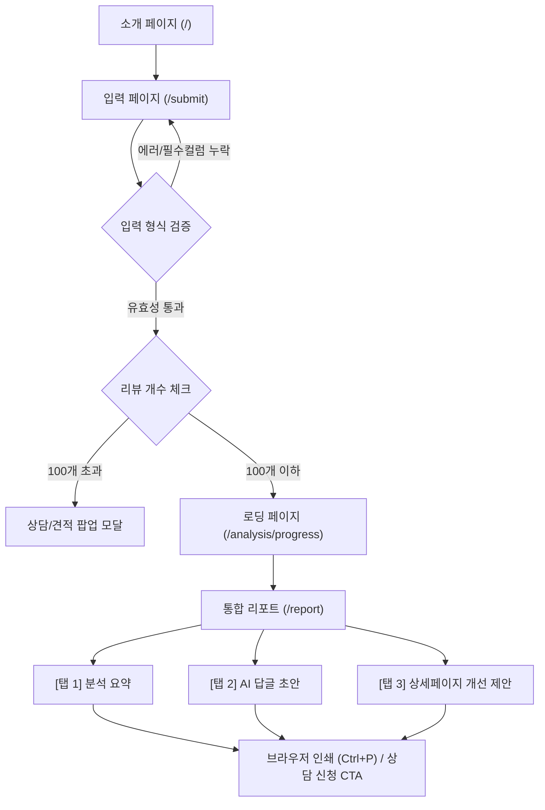

# 📋 S1_PRD_V1_6.md (제품 요구사항 정의서) v1.6 (v0.3)

> [!NOTE]
> 본 문서는 리뷰와이(Reviewai) MVP 개발 방향 및 덱스(Dex)의 구현 기준이 되는 공식 제품 요구사항 정의서(PRD) v1.6입니다. 빌(Bill)과 라이언(Ryan)의 v0.3 표현 교정 사항이 반영되었습니다.

---

## 1. 제품 개요 (Product Overview)
리뷰와이(Reviewai)는 이커머스 사장님들이 고객 리뷰 데이터를 기반으로 부정 리뷰 및 평판 위험 신호를 빠르게 파악하고, 브랜드 톤에 맞는 고객 답글 초안과 상세페이지 개선 참고 포인트를 획득할 수 있도록 돕는 AI 리뷰 관리 솔루션입니다. S2 스프린트에서는 복잡한 기능 연동 없이 **'49,000원 리뷰 진단 리포트 상품'**을 완성하는 데 초점을 맞춥니다.

## 2. 타깃 고객 (Target Audience)
* 스마트스토어, 쿠팡, 자사몰 등을 운영하는 중소형 이커머스 1인 셀러 및 사장님.
* 브랜드 평판을 관리하며 다수의 고객 리뷰에 빠르게 답변하고 개선 사항을 도출해야 하는 브랜드 마케팅 담당자.

## 3. 고객 문제 (Customer Pain Points)
* **평판 위기 대응 지연**: 부정적이거나 환불 소지가 있는 평판 위험 신호 리뷰를 수동으로 하나씩 읽고 찾아내는 데 너무 많은 시간이 소요됩니다.
* **답글 작성 공수**: 브랜드 톤앤매너에 맞으면서도 법적/정책적 리스크가 없는 정중한 답변을 매번 새롭게 작성하는 것이 번거롭고 부담스럽습니다.
* **개선점 도출 한계**: 부정 리뷰 속의 반복적인 불만 포인트를 객관화하여 상세페이지나 FAQ에 어떻게 반영해야 할지 막막합니다.

## 4. MVP 목표 (MVP Objectives)
* 수동 입력(직접 복사-붙여넣기 및 CSV 업로드)을 기반으로 최대 100개의 리뷰를 3분 안에 요약하고 리뷰 요약 및 위험 신호 리포트를 발행하는 프로토타입의 완성.
* Gemini API의 복잡한 연동 이전에, 완벽하게 정비된 UI 컴포넌트와 Mock 데이터 플로우를 구축하여 제품의 가치를 입증합니다.

## 5. 핵심 가치 제안 (Value Proposition)
* **3분 평판 진단**: 복잡한 플랫폼 연동 없이 복사-붙여넣기와 CSV만으로 가장 빠르게 평판 위험 리뷰 리스트와 불만 키워드를 가시화합니다.
* **리스크 방어형 AI 초안**: 민감 표현 검출 가드레일이 탑재되어 문제 소지가 있는 초안을 사전에 경고하며, 사장님이 톤별로 선택하여 즉시 복사해 쓸 수 있는 초안을 제시합니다.

---

## 6. In-Scope 기능 (구현 범위)
* **리뷰 데이터 입력 폼**: 직접 복사-붙여넣기(TextArea) 영역 및 CSV 파일 드롭존(Drop-zone).
* **입력 유효성 및 개수 제약**: 행 수 기준 최대 100개 제한 필터링 및 100개 초과 시 상담 팝업 안내 모달 노출.
* **대시보드 리포트 (`/report`)**: 단일 탭 페이지 구성 및 3대 탭 전환:
  * **[탭 1] 분석 결과 요약**: 별점 하락 우려 신호 배지, 부정 키워드 TOP 5, 평판 위험 우려 리뷰 우선 순위 카드 리스트.
  * **[탭 2] AI 답글 초안**: 4대 브랜드 톤별 답글 초안 3종 리스트, 민감 표현 감지 경고 배지 UI, 클립보드 복사 버튼.
  * **[탭 3] 상세페이지 개선 제안**: 개선 포인트 제안 카드 및 결제/상담 연결 카카오톡 CTA.
* **배너형 인쇄 친화 레이아웃**: `@media print` 스타일 적용으로 리포트 영역만 깨끗하게 출력/인쇄 가능.

## 7. Out-of-Scope 기능 (제외 범위)
* 쇼핑몰 계정 연동 및 크롤링 기반 실시간 자동 리뷰 수집 (S1/S2 완전 제외)
* 카카오톡 리뷰 수집 챗봇 (S3 이후 검토)
* Excel(`.xlsx`) 파일 업로드 및 분석 (S3 이후 검토, S2는 오직 CSV만 지원)
* AI 자동 답글 매장 즉시 등록 및 자동 게시 (100% 사장님 검수 후 복사 기반 작동)
* XAI 기반 허위 리뷰 판정 (허위 리뷰라고 단정 지어 명시하지 않음)
* GEO 마크업 자동 배포 및 도메인 연동
* 백엔드 기반 PDF 자동 생성 및 다운로드 엔진 (브라우저 기본 인쇄 기능으로 우회)
* PG사 실결제 모듈 연동 (추가 신청 및 상담 CTA로 대체)

---

## 8. Summary 사용자 플로우 (User Flow)


---

## 9. 화면별 요구사항 (Page Specifications)

### 9.1. 홈 및 서비스 소개 화면 (`/`)
* 49,000원 리뷰 진단 리포트 상품의 핵심 가치(평판 위기 대응, 답글 시간 단축) 소개.
* "샘플 리포트 확인하기" 및 "리뷰 리포트 만들기" 버튼을 통해 `/submit`으로 이동.

### 9.2. 리뷰 데이터 입력 화면 (`/submit`)
* 스토어 정보(스토어명, 상품명) 입력 필드 제공.
* 직접 입력: 대용량 Textarea 창을 제공하여 사용자가 리뷰를 직접 복사-붙여넣기 할 수 있도록 함.
* CSV 파일 업로드: Drop-zone에 파일을 드래그하거나 파일 탐색기로 선택하여 업로드.
* CSV 템플릿 다운로드 링크 제공 (`sample_review_template.csv`).

### 9.3. 분석 진행 상태 대기 화면 (`/analysis/progress`)
* 리뷰 데이터를 분석 중임을 알리는 스피너 또는 로딩 애니메이션 노출.
* 3초 대기 후 자동으로 `/report` 결과 화면으로 라우팅.

### 9.4. 통합 리포트 화면 (`/report`)
* 상단에 스토어명, 상품명 정보 및 진단 일시 노출.
* 탭 메뉴 바를 제공하여 3개의 탭 페이지 간 화면 전환을 지원.
* **[탭 1] 분석 결과 요약**: 별점 분포 그래프(Mock), 평균 별점, 별점 하락 우려 경고(평균 3.5 이하 등 조건 시 노출), 반복 불만 TOP 5 키워드, 우선 검토가 필요한 위험 신호 리뷰 리스트(별점 1~2점 우선 정렬).
* **[탭 2] AI 답글 초안**: 4대 톤(친절한 사장님형, 전문 브랜드형, 담백한 CS형, 재방문 유도형) 선택 라디오/버튼 제공. 톤 선택 시 해당 3종 답글 렌더링.
  * 법적 대응 소지 및 환불 강제 등 5대 민감 단어 필터링 시 `[민감 표현 감지 - 수동 검수 필수]` 주황/빨강 배지 UI 활성화.
  * 초안 우측에 "복사하기" 버튼 제공 (클릭 시 클립보드 복사 알림 노출).
* **[탭 3] 상세페이지 개선 제안**: 불만 키워드를 기반으로 상세페이지의 보완점(예: 배송 공지, 사이즈 팁)을 요약한 카드 렌더링. 추가 정밀 케어팩 상담을 위한 1:1 카카오톡 채널 CTA 배너 노출.

---

## 10. 입력 데이터 구조 (Input Data Schema)
* **필수 컬럼**:
  * `reviewText` (String) : 고객 리뷰 본문 텍스트.
  * `rating` (Integer, 1~5) : 해당 리뷰의 평점 별점.
* **선택 컬럼**:
  * `date` (String, YYYY-MM-DD) : 리뷰 작성 일자.
  * `options` (String) : 상품 옵션 정보.

## 11. 출력 리포트 구조 (Output Report Structure)
리뷰 요약 및 위험 신호 리포트 결과 데이터 규격은 다음과 같습니다:
```json
{
  "storeName": "String",
  "productName": "String",
  "summary": {
    "totalCount": "Integer",
    "averageRating": "Float",
    "isWarning": "Boolean (별점 3.5 이하 등 평판 우려 시 true)"
  },
  "topComplaints": [
    { "keyword": "String", "count": "Integer", "ratio": "Float" }
  ],
  "riskyReviews": [
    { "text": "String", "rating": "Integer", "date": "String", "options": "String" }
  ],
  "aiDrafts": {
    "friendly": [{ "content": "String", "isSensitive": "Boolean" }],
    "brand": [{ "content": "String", "isSensitive": "Boolean" }],
    "cs": [{ "content": "String", "isSensitive": "Boolean" }],
    "revisit": [{ "content": "String", "isSensitive": "Boolean" }]
  },
  "improvements": [
    { "category": "String", "issue": "String", "tip": "String" }
  ]
}
```

---

## 12. Mock data 우선 개발 정책 (Mock-first Policy)
* 스프린트 2에서는 Gemini API 연동을 하지 않고 프론트엔드가 자체 로컬 `mockData.js` 구조를 로딩하여 모든 입력 폼 예외 처리와 `/report` 탭 내의 시각적 컴포넌트들을 안정적으로 렌더링하도록 구현 기준을 둡니다.
* 이를 통해 백엔드 의존성 없이 프론트엔드의 스타일가이드, 컴포넌트 재사용성, 반응형 품질을 검증 가능한 수준으로 끌어올립니다.

## 13. AI API 연동 보류 정책 (API Postponement)
* Gemini API의 실제 연동은 S2 후반 선택 구현 또는 S3 이후 이월을 기본 정책으로 둡니다.
* 프론트엔드 코드에 Gemini API Key를 직접 노출 및 하드코딩하는 것은 금지하며, 추후 연동 시에는 **Vercel Serverless Functions**를 중계 1순위로 검토하여 API Key 우회 아키텍처를 적용합니다.

---

## 14. 민감 표현 가드레일 (Safety Guardrails)
* **표현 가이드라인**:
  * "진단"이라는 단어는 상품명(`49,000원 리뷰 진단 리포트 상품`)의 비즈니스 맥락에서만 사용하고, 화면 설명에서는 법률적/의료적 확정 판단처럼 명시하지 않습니다.
  * "허위 리뷰" 혹은 "블랙컨슈머"라는 확정 단정적 표현을 쓰지 않고, **"위험 신호"**, **"검토 필요"**, **"확인 필요"**, **"주의 표현"**으로 완화하여 사장님께 안내합니다.
  * AI 답글은 항상 **"초안"**임을 명문화하며, 사장님이 100% 검수 후 복사하여 사용하는 수동 가이드라인 문구를 화면에 명확히 표기합니다.
* **5대 위험 표현군 분류 및 예시**:
  1. **환불/보상 약속**: 무조건적인 금전성 보상이나 무리한 약속
     * *예시: "환불해드리겠습니다", "보상해드리겠습니다"*
  2. **책임 인정 단정**: 사실관계 확인 전 과도한 저자세 및 단정적 귀책 표현
     * *예시: "전적으로 저희 잘못입니다"*
  3. **의료/법률 단정**: 서비스 범위 밖의 사법 및 의학적 효과 보장 표현
     * *예시: "치료됩니다", "완치됩니다"*
  4. **고객 공격**: 부정 리뷰를 작성한 고객을 적대시하거나 단정 짓는 문구
     * *예시: "허위 리뷰입니다"*
  5. **플랫폼 정책 위험 표현**: 쇼핑몰이나 플랫폼의 이용 정지 및 정책 제재를 위반하는 가이드라인
     * *예시: "리뷰 삭제해드리겠습니다", "별점 올려드립니다", "검색 노출을 보장합니다"*
* **가드레일 UI 사양**:
  * 답글 초안 중 위의 5대 민감 표현이 검출되면 UI상에 `[민감 표현 감지 - 수동 검수 필수]`라는 빨간색/주황색의 주의 환기 배지를 노출시킵니다.

## 15. 보안 요구사항 (Security Requirements)
* 프론트엔드 코드 내에 하드코딩된 Secret Key나 개인정보 노출 금지.
* API 토큰(`ntn_...`) 등 민감 정보는 형상 관리에 업로드하지 않으며, 작업 로그 및 실행 결과물 출력 파일에서도 `****MASKED****` 처리 원칙을 적용하여 보안 유출 가능성을 낮춥니다.

---

## 16. 완료 기준 (Definition of Done)

### 16.1. PRD 완료 기준
* 빌(Bill) 1차 검수 완료.
* 라이언(Ryan) 최종 승인 완료.
* In-Scope / Out-of-Scope 공식 확정.
* 덱스(Dex) 작업 분해(Story/Task)에 필요한 세부 요구사항 누락 없음.
* 금지 표현 가이드라인 및 민감 표현 가드레일 반영 완료.

### 16.2. S2 개발 완료 기준
* Mock data 기반 `/report` 화면의 3대 탭 정상 렌더링 및 전환.
* 직접 복사-붙여넣기 및 CSV 입력 파싱 기능이 동작.
* 입력 데이터의 100개 개수 한계선 제한 로직 및 팝업 모달 정상 동작.
* 5대 민감 표현 감지 시 경고 배지 UI 정상 표출.
* 브라우저 인쇄 단축키 입력 시 인쇄 전용 CSS 레이아웃 출력 확인.
* 형상 관리 코드 및 실환경 내 실제 API Key / Notion 토큰 노출 없음.

---

## 17. QA 기준 (QA Checklist)
* [ ] 직접 붙여넣기 및 CSV 파일 드롭존이 정상 동작하고 파싱 에러 팝업이 발생하는가?
* [ ] 100개 제한 로직 작동 및 100개 초과 시 상담 팝업 모달이 정상 팝업되는가?
* [ ] 4대 톤 탭을 변경할 때마다 매칭되는 AI 답글 초안 3종이 오류 없이 렌더링되는가?
* [ ] 5대 민감 표현 필터링 시 `[민감 표현 감지 - 수동 검수 필수]` 배지가 정상 활성화되는가?
* [ ] 인쇄 미리보기(`/report`에서 Ctrl+P/Cmd+P 실행) 시 리포트 헤더와 본문 탭 내용만 한 장 내외로 깔끔하게 정리되어 나오는가?
* [ ] 소스 코드, 설정 파일, 마크다운 문서 등에 실제 API Key/토큰이 노출되지 않았는가?

---

## 18. 빌/라이언 확인 필요 질문 및 확정 사항 (Confirmed Decisions)
* **Q1. 100개 초과 시 모달 팝업 가이드 문안 및 CTA**:
  * **[확정 결정]**: 카카오톡 1:1 채널을 1순위 CTA로 두어 직접 이동하도록 연동합니다. 이메일 또는 신청 폼 등은 S3 이후의 보조 채널로 검토 이월합니다.
* **Q2. 모바일 반응형 뷰 테스트 기기 및 Viewport 규격**:
  * **[확정 결정]**: S2 덱스 개발 및 반응형 최적화 시 아래 3개 Viewport 크기를 기준으로 검증을 진행합니다.
    * iPhone SE 폭 (375px)
    * 일반 모바일 폭 (390px)
    * 데스크톱 폭 (1440px)
