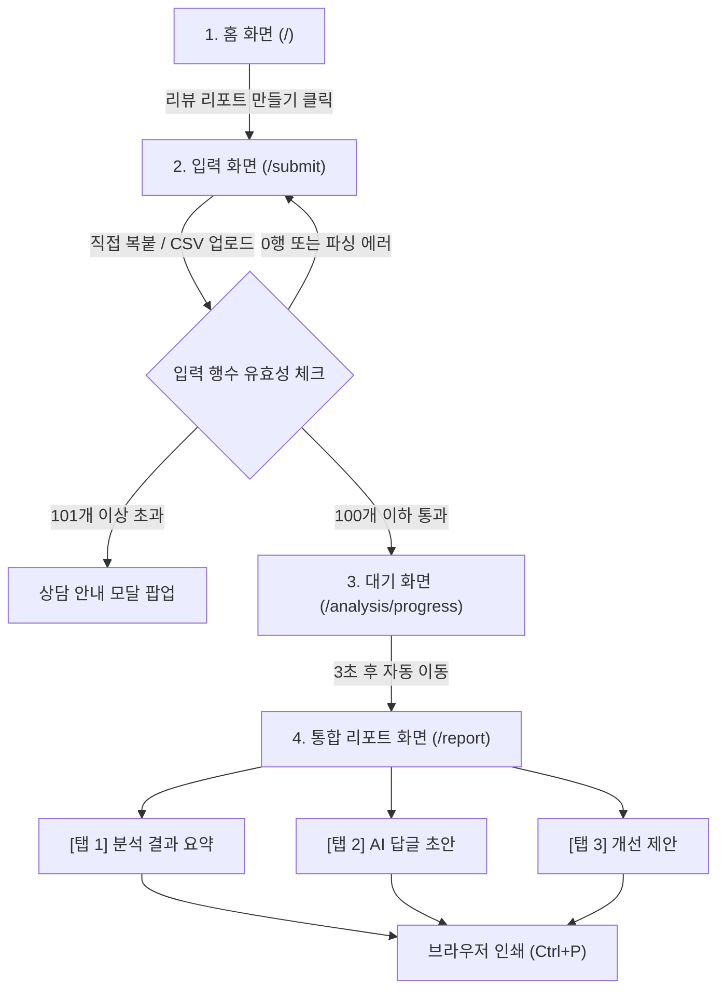

# 🎨 S1_UX_UI_V1_6.md (서비스 화면 설계 및 디자인 시스템) v1.6 (v0.5)

> [!NOTE]
> 본 문서는 리뷰와이(Reviewai) MVP 단계의 공식 UX/UI 설계 사양서입니다. 개발을 담당할 덱스(Dex)가 화면 레이아웃, 컴포넌트 구조, 인터랙션을 설계할 때 표준 개발 기준으로 사용합니다. 빌(Bill)과 라이언(Ryan)의 v0.5 표현 안정화 피드백이 반영되었습니다.

---

## 1. UX 설계 원칙 (UX Principles)
1. **3분 이내 정보 습득**: 복잡한 대시보드 구조를 지양하고, 사장님이 회원가입이나 연동 없이 첫 화면부터 리포트 획득까지 약 3분 내외로 완료할 수 있도록 극도의 단순함을 유지합니다.
2. **수동 입력의 신뢰성 제공**: 크롤링 오류나 수집 실패 리스크가 없도록 복사-붙여넣기 및 CSV 업로드 시 데이터가 정상 유입되었음을 사용자에게 즉각적이고 명확한 시각적 피드백(업로드 건수 표시 등)으로 제공합니다.
3. **가드레일 투명성**: AI 답변은 기계적 자동 발송이 아닌 사장님이 확인하고 직접 판단 및 복사해 쓰는 도구임을 인지시키기 위해 경고 안내와 편집 편의성을 최우선으로 제공합니다.

---

## 2. 핵심 사용자 시나리오 (User Scenarios)
* **유저 프로필**: 스마트스토어에서 패션 의류를 판매하는 1인 셀러 김사장님.
* **시나리오**:
  1. 김사장님은 최근 특정 신상품의 평점이 떨어지는 것 같아 원인을 찾고 싶어 합니다.
  2. 리뷰와이 홈 화면(`/`)에 접속하여 서비스 가치 제안을 보고 "리뷰 리포트 만들기"를 누릅니다.
  3. 입력 화면(`/submit`)에서 네이버 스마트스토어 리뷰 목록을 CSV로 다운로드받아 파일 영역에 드롭합니다.
  4. 시스템이 "총 85개의 리뷰가 감지되었습니다"라고 띄우는 유효성 상태를 확인하고 분석을 요청합니다.
  5. 3초간의 분석 로딩(`/analysis/progress`)을 거친 후 결과 리포트 대시보드(`/report`)로 이동합니다.
  6. **[탭 1]**에서 "사이즈 불만"이 반복 불만 TOP 1위이며 평점 하락 위험 신호가 켜져 있음을 인지합니다.
  7. **[탭 2]**에서 고객의 불만에 빠르게 대응하기 위해 '담백한 CS형' 톤의 AI 답변 초안 중 민감 표현 경고가 없는 답변 초안을 복사하여 스마트스토어 리뷰 답글로 등록합니다.
  8. **[탭 3]**에서 "상세페이지 상단에 실제 측정 사이즈 비교 표를 추가하라"는 제안 카드를 읽고, 상세페이지 교정을 기획하며 상세 리포트 월간 상담 CTA 배너를 클릭해 1:1 상담을 연결합니다.

---

## 3. 전체 사용자 플로우 (User Flow Diagram)


---

## 4. 화면 목록 (Screen Directory)
1. **`/` (홈 / 서비스 소개 화면)**: 상품 안내 및 샘플 보고서 유도.
2. **`/submit` (리뷰 데이터 입력 화면)**: 스토어 입력 폼, 직접 복붙 영역, CSV 업로드 컴포넌트 통합 화면.
3. **`/analysis/progress` (분석 대기 화면)**: 백그라운드 프로세싱 인포그래픽 로딩 화면.
4. **`/report` (통합 리포트 대시보드 화면)**: 분석 요약, AI 답글, 개선 제안의 3개 내부 탭 구조를 가지는 결과 화면.

---

## 5. `/` 홈 화면 와이어프레임 (Landing Page Wireframe)
```text
+-----------------------------------------------------------------------------+
|  [로고] Reviewai (리뷰와이 — 사장님 리뷰비서)                                 |
+-----------------------------------------------------------------------------+
|                                                                             |
|                    "약 3분 내외로 정리하는 고객 불만 신호와                 |
|                        브랜드 맞춤형 AI 리뷰 답글 비서"                     |
|                                                                             |
|    수집 연동 없이, 다운로드한 리뷰 파일만 올리면 평판 위험 신호를 빠르게       |
|    확인할 수 있도록 돕습니다.                                                 |
|                                                                             |
|                 +----------------------------------------+                  |
|                 |          [ 리뷰 리포트 만들기 ]        |  <-- Primary CTA  |
|                 +----------------------------------------+                  |
|                                                                             |
|    --------------------------------------------------------------------     |
|    [ 샘플 리포트 미리보기 ]                                                   |
|    +------------------------------------------------------------------+     |
|    | * 스토어 평점 요약: ★ 3.8 / 5.0  (위험 신호 감지됨)                  |     |
|    | * 핵심 불만 키워드: [배송 지연] [포장 파손] [불친절]                 |     |
|    | * AI 추천 답글: "불편을 드려 죄송합니다. 신속하게..." (복사 가능)       |     |
|    +------------------------------------------------------------------+     |
|                                                                             |
+-----------------------------------------------------------------------------+
```

---

## 6. `/submit` 입력 화면 와이어프레임 (Input Page Wireframe)
```text
+-----------------------------------------------------------------------------+
|  [로고] Reviewai  < 홈으로 이동                                               |
+-----------------------------------------------------------------------------+
|                                                                             |
|  1. 스토어 정보 입력                                                          |
|     스토어명: [ 스마트스토어 예시           ]  상품명: [ 고급 디퓨저 세트   ]   |
|                                                                             |
|  2. 리뷰 데이터 입력 (직접 복사-붙여넣기 또는 CSV 파일 첨부)                       |
|  +-----------------------------------------------------------------------+  |
|  | [ 직접 텍스트 붙여넣기 탭 ]      |  [ CSV 파일 업로드 탭 ] (활성)           |  |
|  +-----------------------------------------------------------------------+  |
|  |                                                                       |  |
|  |      +---------------------------------------------------------+      |  |
|  |      |               [ CSV 파일 드래그 앤 드롭 ]               |      |  |
|  |      |                                                         |      |  |
|  |      |               또는 [컴퓨터에서 파일 선택]               |      |  |
|  |      +---------------------------------------------------------+      |  |
|  |                                                                       |  |
|  |   * 필수 열: reviewText (리뷰 내용), rating (1~5 별점)                 |  |
|  |   * 업로드 가능 제한: 최대 100개 리뷰 행                              |  |
|  |                                                                       |  |
|  |   +--------------------------+     +-------------------------------+  |
|  |   | [ 템플릿 다운로드 (.csv) ] |     | [ 테스트용 샘플 데이터 불러오기 ] |  |  |
|  |   +--------------------------+     +-------------------------------+  |
|  +-----------------------------------------------------------------------+  |
|                                                                             |
|                 +----------------------------------------+                  |
|                 |          [ 리포트 분석하기 ]           |                  |
|                 +----------------------------------------+                  |
|                                                                             |
+-----------------------------------------------------------------------------+
```

---

## 7. `/analysis/progress` 분석 대기 화면 와이어프레임 (Loading Page)
```text
+-----------------------------------------------------------------------------+
|                                                                             |
|                                                                             |
|                                    / \                                      |
|                                   | * |  <-- Spinner Rotating Animation     |
|                                    \ /                                      |
|                                                                             |
|                          "리뷰 데이터를 분석하고 있습니다."                  |
|                   반복 불만 포인트와 위험 신호를 정리하는 중입니다.                 |
|                            잠시만 기다려 주세요...                          |
|                                                                             |
|                                                                             |
+-----------------------------------------------------------------------------+
```

---

## 8. `/report` 통합 리포트 화면 와이어프레임 (Dashboard Landing)
```text
+-----------------------------------------------------------------------------+
|  [로고] Reviewai  |  스마트스토어 예시 - 고급 디퓨저 세트 리포트                  |
|  리포트 생성일시: 2026-06-06 01:32 | [ 리포트 인쇄하기 ] <-- 브라우저 인쇄 연동   |
+-----------------------------------------------------------------------------+
|                                                                             |
|  +-----------------------------------------------------------------------+  |
|  |  [탭 1] 분석 결과 요약 (활성)  |  [탭 2] AI 답글 초안  |  [탭 3] 개선 제안  |  |
|  +-----------------------------------------------------------------------+  |
|  |                                                                       |  |
|  |  ★ 3.8 / 5.0 (총 85건 분석 완료)   [ 평판 위험 경고 배지 노출 - 빨간색 ]  |  |
|  |                                                                       |  |
|  |  [ 반복 불만 TOP 5 키워드 ]                                            |  |
|  |  1. 배송 지연 (12건)   2. 액체 누수 (8건)   3. 향이 약함 (5건) ...        |  |
|  |                                                                       |  |
|  |  [ 우선 검토가 필요한 위험 신호 리뷰 리스트 ] (별점 낮은 순 정렬)            |  |
|  |  +-----------------------------------------------------------------+  |  |
|  |  | 평점: ★1  | 작성일: 2026-06-02                                  |  |  |
|  |  | 내용: 일주일이 넘어도 배송이 안 오네요. 사기 아닌가요? 환불해줘요.   |  |  |
|  |  | [위험 신호] [배송 관련]                                           |  |  |
|  |  +-----------------------------------------------------------------+  |  |
|  |  | 평점: ★2  | 작성일: 2026-06-01                                  |  |  |
|  |  | 내용: 뚜껑이 깨져서 액체가 다 흘러내려 박스까지 다 젖었습니다.      |  |  |
|  |  | [검토 필요] [포장/배송]                                           |  |  |
|  |  +-----------------------------------------------------------------+  |  |
|  |                                                                       |  |
|  +-----------------------------------------------------------------------+  |
|                                                                             |
+-----------------------------------------------------------------------------+
```

---

## 9. `/report` 내부 탭 3개 구조 (Three Tabs Navigation)
동일 페이지 내에서 렌더링 세션 탭 전환이 유기적으로 처리됩니다.
* **[탭 1] 분석 결과 요약 (Summary)**: 전체 리뷰 평점 및 누적 지표, 주요 부정 키워드 통계 칩, 하락 우려 신호 경고 배지, 부정 리뷰 목록 카드가 배치됩니다.
* **[탭 2] AI 답글 초안 (Replies)**: 4종 브랜드 톤(친절한 사장님형, 전문 브랜드형, 담백한 CS형, 재방문 유도형)별 탭 및 선택에 맞춰 동적으로 변하는 추천 답글 카드 3개가 노출됩니다.
* **[탭 3] 상세페이지 개선 제안 (Improvements)**: 자주 발견된 고객의 통증 지점(Pain point)을 상세페이지 기획/설명으로 우회 방어할 수 있도록 돕는 솔루션 제안 카드와 월간 정밀 케어 1:1 상담용 카카오톡 CTA 배너가 구성됩니다.

---

## 10. CSV 업로드 UI 기준 (CSV Upload Design Guidelines)
* **드롭존 스타일**: 점선 테두리(`border: 2px dashed #3B82F6`), 라운드 모서리 처리. 배경은 연한 파란색 톤(`background: #EFF6FF`).
* **파일 감지 피드백**: 파일 감지 시 점선이 실선으로 바뀌고, 업로드 완료 시 녹색 체크 아이콘과 함께 파일명(예: `reviews.csv`) 및 감지된 총행 수(예: `총 85건 리뷰 파싱 완료`)를 노출합니다.
* **템플릿 다운로드 및 샘플 버튼**: 업로드 영역 바로 하단에 배치하여 신규 사용자의 접근 동선을 최소화합니다.

---

## 11. 100개 초과 시 상담 팝업 UI (Limit Excess Alert Modal)
* **모달 레이아웃**: 어두운 반투명 백드롭 배경(`background: rgba(0, 0, 0, 0.5)`) 중앙에 화이트 카드 배치.
* **헤더/타이틀**: `⚠️ 대량 리뷰 안내`
* **본문 문구**: "49,000원 리뷰 진단 리포트 상품의 1회 최대 분석 한계는 100건입니다. 현재 입력된 데이터는 125건입니다. 100건을 초과하는 대규모 누적 리뷰 분석 및 월간 리포트 상담은 카카오톡 1:1 문의를 통해 직접 상담을 접수해 주세요."
* **버튼 구성**:
  * **[ 카카오톡 1:1 상담 문의 ]** (Primary CTA - 카카오 노란색 배경 `#FEE500` 적용)
  * **[ 닫기 ]** (Secondary Outline)

---

## 12. AI 답글 초안 카드 UI (AI Reply Card Layout)
```text
+-----------------------------------------------------------------------------+
|  [친절한 사장님형]  [전문 브랜드형 (선택)]  [담백한 CS형]  [재방문 유도형]    |
+-----------------------------------------------------------------------------+
|                                                                             |
|  ■ 추천 답글 초안 1                                                           |
|  +-----------------------------------------------------------------------+  |
|  | 안녕하세요 사장님입니다. 우선 배송 문제로 깊은 실망감을 드려 머리 숙여      |  |
|  | 사과드립니다. 해당 택배사와 빠르게 접촉하여 확인 후 피드백 드리겠습니다.    |  |
|  |                                                                       |  |
|  |               [ 민감 표현 감지 - 수동 검수 필수 ] <-- 경고 배지 노출       |  |
|  |               +-----------------------------+                         |  |
|  |               |    [ 클립보드로 복사하기 ]  |                         |  |
|  |               +-----------------------------+                         |  |
|  +-----------------------------------------------------------------------+  |
|                                                                             |
|  * 주의: AI가 생성한 초안은 예시이므로, 전송 전 반드시 담당자가 최종 검수해야 합니다. |
|                                                                             |
+-----------------------------------------------------------------------------+
```

---

## 13. 민감 표현 감지 배지 UI (Safety Warning Badge)
* **배지 스타일**: 붉은색 또는 주황색 배경, 폰트 굵게, 테두리 라운드 칩 UI (`background: #FEF3C7; color: #D97706; border: 1px solid #F59E0B;`).
* **노출 조건**: 답글 초안 텍스트 내에 5대 위험 표현(환불 확답, 전적인 과실 자백, 치료/완치 단정, 고객 저격, 검색 보장 등)이 감지되면 카드 내부 우측 하단 또는 텍스트 상단에 경고 아이콘과 함께 활성화됩니다.

---

## 14. 상세페이지 개선 제안 카드 UI (Page Improvement Card)
```text
+-----------------------------------------------------------------------------+
|  💡 상세페이지 설명 및 FAQ 교정 제안                                          |
+-----------------------------------------------------------------------------+
|                                                                             |
|  [분석 결과 요약]: 리뷰 내 "향이 금방 날아간다", "지속력 부족" 관련 언급 다수 감지.   |
|                                                                             |
|  +-----------------------------------------------------------------------+  |
|  |  추천 반영 가이드 카드                                                  |  |
|  |  * 상세페이지 상단에 '고급 디퓨저 오일 지속 시간 안내 FAQ' 추가 추천      |  |
|  |  * 문구 제안: "본 디퓨저는 천연 에센셜 오일을 사용하여 인공 향료에 비해    |  |
|  |    자극은 적으나 밀폐되지 않은 넓은 공간에서는 지속 시간이 다르게 느껴질    |  |
|  |    수 있습니다. 지속력을 올리는 배치 꿀팁 3가지를 확인해 보세요!"           |  |
|  +-----------------------------------------------------------------------+  |
|                                                                             |
+-----------------------------------------------------------------------------+
```

---

## 15. 카카오톡 1:1 CTA 위치 (KakaoTalk CTA Placement)
* **리포트 화면 하단**: `/report` [탭 3] 화면 최하단에 배너 형태로 고정 배치합니다.
  * *배너 문구: "누적된 부정 리뷰의 반복 원인을 더 깊게 확인하고 싶으신가요? 월간 리뷰 관리 상담을 1:1 받아 보세요."*
* **100개 제한 팝업 모달 내부**: 100건 초과 안내 팝업 정중앙에 카카오톡 노란색 버튼 형태로 가장 잘 보이게 구성합니다.

---

## 16. 모바일 반응형 기준 (Responsive Layout Breakpoints)
* **375px (iPhone SE) 및 390px (일반 모바일)**:
  * 모든 Grid 레이아웃을 1열 세로 배치로 전환합니다.
  * 입력 폼의 좌우 여백(Padding)을 12px~16px로 최소화하여 모바일 사용성을 확보합니다.
* **1440px (데스크톱)**:
  * 대시보드 구조의 좌우 칼럼 정렬을 활성화하고 카드 컴포넌트를 병렬 배치합니다.
  * 최대 콘텐트 컨테이너의 가로 폭은 1200px로 클램핑(Clamping)하여 와이드 모니터에서의 흐트러짐을 방지합니다.

---

## 17. 브라우저 인쇄 레이아웃 기준 (Browser Print Guidelines)
* **인쇄 미디어 쿼리 적용 (`@media print`)**:
  * 인쇄 영역 외부 컴포넌트(Header 내비, Footer, 탭 전환 버튼, 복사하기 버튼, 카카오톡 상담 배너 등)는 인쇄 출력물에서 제외(`display: none`) 처리합니다.
  * 브라우저 인쇄 설정 시 여백이 깨지지 않도록 좌우 여백을 A4 비율에 맞게 조정합니다.
  * 배경을 순수 흰색으로 고정하고 다크 그레이 단색 폰트를 채택하여 인쇄 시 주요 내용을 안정적으로 확인할 수 있도록 합니다.

---

## 18. 덱스(Dex) 구현 시 주의사항 (Developer Guardrails)
* **자동 수집 UI 묘사 금지**: URL 입력 칸은 자동 수집이 보장되는 것처럼 과장하지 않으며, CSV 및 직접 입력을 유도하는 상태를 유지합니다.
* **단정 표현 배제**: 화면이나 리포트 상에서 "허위 리뷰", "악성 사용자"라는 표현을 UI에 표시하지 않고, **"검토 필요"**, **"위험 신호"** 태그 칩으로만 명시합니다.
* **비즈니스 약속 보장 문구 배제**: 평점 무조건 상승, 리뷰 100% 삭제, 매출 보장 등 비현실적인 사업적 효과 보증 문구는 UI 전반에 절대 포함하지 않습니다.
* **Mock data 최우선 탑재**: S2 구현의 핵심은 실제 AI 연동이 아닌 **Mock data를 기반으로 UI와 탭의 전환 구조가 브라우저상에서 안정적으로 동작하게 구성하는 것**입니다. 덱스는 mockData.js 구조를 최우선으로 제작해야 합니다.

---

## 19. Visual Design System (시각 디자인 시스템)
덱스는 CSS 구현 시 아래 정의된 디자인 토큰들을 최우선 변수로 할당하여 UI 일관성을 확보합니다.

* **Color Palette (컬러 사양)**:
  * `Primary Color` (핵심 신뢰 블루): `#2563EB` 또는 `#1D4ED8` (브랜드 정체성 표현 및 핵심 컴포넌트)
  * `Background` (배경 톤): `#F8FAFC` (미세한 그레이/블루가 감도는 세련된 기본 배경)
  * `Card Background` (컨텐츠 카드 배경): `#FFFFFF` (순백색 레이어)
  * `Border` (외곽선): `#E2E8F0` (은은하고 고급스러운 구분선)
  * `Text Primary` (주 폰트 색상): `#0F172A` (가독성을 극대화한 거의 다크 네이비 톤의 블랙)
  * `Text Secondary` (부 폰트 색상): `#64748B` (메타데이터 및 부가 설명을 위한 세련된 딤 그레이)
  * `Warning` (주의 알림 포인트): `#F97316` (주의 표현 감지용 테두리 및 칩 배경)
  * `Danger` (경고 배지/하락 우려): `#DC2626` (부정/위험 우려 및 에러 알림)
  * `Success` (통과/파싱 성공): `#16A34A` (정상 파싱 및 성공 정보 노출)
  * `Kakao CTA` (카카오 상담 노랑): `#FEE500` (상담 전환용 고유 브랜드 컬러)
* **Typography (서체 스펙)**:
  * 기본 폰트 패밀리는 가독성이 우수하고 현대적인 **Pretendard**를 우선 적용하며, 브라우저 환경에 따라 `system-ui`, `-apple-system`, `BlinkMacSystemFont`, `sans-serif` 폴백을 지정합니다.

---

## 20. Component Design Guidelines (컴포넌트 설계 규칙)

### 20.1. Primary Button (주요 조작 버튼)
* **용도**: 입력 페이지의 "리뷰 리포트 분석하기", 팝업 모달의 카카오톡 1:1 상담 연동.
* **시각 스타일**: Primary Color (`#2563EB`) 솔리드 배경, 화이트 폰트, 호버 시 `#1D4ED8`로 어두워짐.
* **여백/라운드/그림자**: `padding: 12px 24px`, `border-radius: 8px`, `font-weight: 600`, subtle shadow (`box-shadow: 0 4px 6px -1px rgba(0,0,0,0.1)`).
* **문구 예시**: `리뷰 리포트 만들기`, `카카오톡 1:1 상담 문의`
* **금지 표현**: "자동 수집 시작", "평점 즉시 올리기" 등 효과 보장 단어 금지.

### 20.2. Secondary Button (보조 조작 버튼)
* **용도**: 팝업 닫기 버튼, 샘플 리뷰 데이터 불러오기.
* **시각 스타일**: Outlined 스타일 (`border: 1px solid #E2E8F0`), 배경 투명, 호버 시 `#F8FAFC`.
* **여백/라운드/그림자**: `padding: 12px 24px`, `border-radius: 8px`, 그림자 배제.
* **문구 예시**: `닫기`, `샘플 데이터 불러오기`
* **금지 표현**: 현금 환불, 즉시 보상 약속 등 유도 문구 금지.

### 20.3. Card (컨텐츠 카드)
* **용도**: 상세페이지 개선 팁 카드, 리포트 내 섹션 컨테이너.
* **시각 스타일**: `#FFFFFF` 배경, 아주 미세한 회색 테두리(`border: 1px solid #E2E8F0`).
* **여백/라운드/그림자**: `padding: 24px`, `border-radius: 12px`, soft shadow (`box-shadow: 0 1px 3px rgba(0,0,0,0.05)`).
* **사용 문구 예시**: `💡 상세페이지 FAQ 교정 제안`
* **금지 표현**: "허위 리뷰 목록", "악성 사용자 명단" 등 부정 단정 표현 금지.

### 20.4. Metric Card (핵심 지표 카드)
* **용도**: 리포트 상단 평점, 리뷰 개수 등의 숫자 지표 요약.
* **시각 스타일**: 큰 굵은 폰트(28px 이상), 레이블 텍스트는 Text Secondary 적용.
* **여백/라운드/그림자**: `padding: 20px`, `border-radius: 10px`, background `#FFFFFF`.
* **사용 문구 예시**: `평균 평점`, `총 리뷰 수`, `검토 우선 리뷰`
* **금지 표현**: "100% 확실한 점수", "상승 보장 수치" 표기 금지.

### 20.5. Warning Badge (가드레일 경고 배지)
* **용도**: AI 답글 초안 중 민감 표현 탐지 시 사용자 경고.
* **시각 스타일**: Soft Orange 배경 (`#FEF3C7`), 테두리 `#F59E0B`, 글자색 `#D97706`.
* **여백/라운드/그림자**: `padding: 4px 8px`, `border-radius: 4px`, `font-size: 12px`, 그림자 없음.
* **사용 문구 예시**: `[민감 표현 감지 - 수동 검수 필수]`
* **금지 표현**: "허위 리뷰 작성 차단 완료", "고객 차단 가능" 등 과장 금지.

### 20.6. Keyword Chip (부정/긍정 키워드 칩)
* **용도**: 리포트의 TOP 5 불만 키워드 시각화.
* **시각 스타일**: 부정 키워드는 연한 빨간색 톤, 긍정 키워드는 연한 파란색 톤 배경.
* **여백/라운드/그림자**: `padding: 6px 12px`, `border-radius: 20px`, hover 시 축소 필터 기능 강조.
* **사용 문구 예시**: `배송 지연 (12건)`, `불만 키워드`
* **금지 표현**: "블랙컨슈머 키워드"와 같은 단어 절대 사용 금지.

### 20.7. Review Card (리뷰 리스트 카드)
* **용도**: 검토 우선순위 부정 리뷰 노출.
* **시각 스타일**: 평점 별점 노출 및 텍스트 박스, 우측에 필터 태그 탑재.
* **여백/라운드/그림자**: `padding: 16px`, `border-radius: 8px`, `border-left: 4px solid #DC2626` (위험 등급 강조).
* **사용 문구 예시**: `★1 | 배송 관련 확인 필요`
* **금지 표현**: "허위 리뷰 주의", "악성 의심" 단어 배제.

### 20.8. Reply Draft Card (AI 답변 초안 카드)
* **용도**: AI 추천 답글 제공 및 복사.
* **시각 스타일**: 텍스트 상자 및 복사하기 버튼, 우측 Warning Badge 포함.
* **여백/라운드/그림자**: `padding: 20px`, `border-radius: 8px`, `background: #F8FAFC`.
* **사용 문구 예시**: `답변 복사하기`, `추천 답글 초안`
* **금지 표현**: "자동 전송", "매장 자동 등록" 표현 금지 (오직 수동 복사).

### 20.9. CTA Banner (상담 유도 배너)
* **용도**: 상세페이지 개선 탭 하단 상담 신청 유도.
* **시각 스타일**: 그라데이션 또는 다크 네이비 배경, Kakao 노란색 버튼 배치.
* **여백/라운드/그림자**: `padding: 32px`, `border-radius: 16px`.
* **사용 문구 예시**: `누적된 부정 리뷰의 반복 원인을 더 깊게 확인하고 싶으신가요?`
* **금지 표현**: "매출 2배 상승 상담", "평점 무조건 상승" 등 확정 보장 표현 금지.

### 20.10. Modal (팝업 모달)
* **용도**: 100개 초약 예외 및 CSV 파싱 에러 알림.
* **시각 스타일**: `backdrop-filter: blur(4px)`를 동반한 암색 레이어 위에 화이트 모달 창 안착.
* **여백/라운드/그림자**: `padding: 30px`, `border-radius: 16px`, `box-shadow: 0 20px 25px -5px rgba(0,0,0,0.1)`.
* **사용 문구 예시**: `대량 리뷰 안내`, `상담 접수`
* **금지 표현**: "이용 차단", "결제 필요" 등 위압감을 주는 단어 배제.

---

## 21. Report Dashboard Visual Hierarchy (대시보드 시각 계층 구조)
리포트 결과 페이지(`/report`) 상단 영역은 사장님이 평판 요약을 즉각 인지할 수 있도록 다음과 같은 엄격한 레이아웃 구조를 갖춥니다.

```text
+-----------------------------------------------------------------------------+
|  [로고] Reviewai  |  스마트스토어 예시 - 고급 디퓨저 세트 리포트                  |
|  리포트 생성일시: 2026-06-06 01:42 | [ 리포트 인쇄하기 ]                          |
+-----------------------------------------------------------------------------+
|                                                                             |
|  [ 핵심 지표 카드 4개 ]                                                      |
|  +------------------+ +------------------+ +------------------+ +---------+  |
|  | 1. 총 리뷰 수    | | 2. 평균 별점     | | 3. 부정 키워드 수| | 4. 검토   |  |
|  |     85건         | |    ★ 3.8 / 5.0  | |     14개         | | 우선 리뷰|  |
|  |                  | | (평판 확인 필요) | |                  | |   12건    |  |
|  +------------------+ +------------------+ +------------------+ +---------+  |
|                                                                             |
|  [ 오늘의 핵심 요약 3개 카드 ]                                               |
|  +-----------------------------------------------------------------------+  |
|  | 카드 1: "지난 주 대비 별점 2점 이하 부정 리뷰 비율이 4.2% 증가했습니다."  |  |
|  | 카드 2: "배송 지연과 포장 누수에 관한 고객 확인 필요 신호가 집중됩니다."   |  |
|  | 카드 3: "AI가 생성한 친절한 답변 초안을 활용해 빠른 대응을 검토하세요."    |  |
|  +-----------------------------------------------------------------------+  |
|                                                                             |
|  +-----------------------------------------------------------------------+  |
|  |  [탭 1] 분석 결과 요약 (활성)  |  [탭 2] AI 답글 초안  |  [탭 3] 개선 제안  |  |
|  +-----------------------------------------------------------------------+  |
|                                                                             |
+-----------------------------------------------------------------------------+
```
* **구조 설계 규칙**:
  * **핵심 지표 카드**: 사장님이 가장 먼저 확인해야 할 정량적 수치를 병렬 배치합니다. ("위험 확정" 등 과격한 명칭 대신 **"검토 우선 리뷰"**, **"확인 필요"**, **"위험 신호"** 등 안전한 완화 표현 사용)
  * **오늘의 핵심 요약**: 정량 지표 하단에 자연스러운 문장(텍스트) 형태로 요약 카드를 노출하여 전반적인 현황을 한눈에 읽을 수 있도록 유도합니다.

---

## 22. Landing Page Conversion Layout (랜딩 페이지 레이아웃 흐름)
홈 화면(`/`)은 고객 전환율을 높이기 위해 아래 구조적 컴포넌트 흐름에 따라 순차적으로 스크롤되도록 CSS 및 구조를 정렬합니다.

1. **Hero Section (히어로 영역)**:
   * "약 3분 내외로 정리하는 고객 불만 신호와 브랜드 맞춤형 AI 리뷰 답글 비서" 헤드라인 및 "리뷰 리포트 만들기" Primary CTA 버튼 배치.
2. **3개 가치 카드 (3 Core Value Cards)**:
   * 카드 A: `빠른 파악` - 수동 복사/업로드로 약 3분 내외로 평판 요약 확인.
   * 카드 B: `리스크 방어` - 5대 민감 단어 가드레일이 적용된 맞춤 답글 초안 제공.
   * 카드 C: `상세페이지 교정` - 고객 이탈을 막는 상세페이지 문구 제안 가이드.
3. **샘플 리포트 미리보기 (Interactive Preview)**:
   * 실제 발행되는 `/report` 화면의 핵심 컴포넌트(핵심 지표 카드 및 AI 답변 톤 전환기)를 소형 인터랙션이 가능한 목업 모듈로 표시하여 체험 제공.
4. **이런 사장님에게 추천 (Target Customer Scenario)**:
   * "리뷰 답변 쓰느라 퇴근이 늦어지는 셀러", "부정 리뷰 대응 방식이 막막한 초보 셀러", "상세페이지를 고쳐 이탈율을 줄이고 싶은 사장님" 등 3대 페르소나 매칭 영역.
5. **49,000원 리뷰 진단 리포트 상품 구성 (Pricing details)**:
   * 수동 데이터 100건 기준 리뷰 리포트 제공, 4대 톤별 답글 초안 제공 및 복사 사용 혜택 요약 단일 단가 노출 (실결제 연동 없이 신청 채널 연결).
6. **하단 전환 CTA (Footer CTA)**:
   * 스크롤 하단에 다시 한 번 커다란 "리뷰 리포트 만들기" 버튼 배치하여 입력 폼(`/submit`)으로 부드럽게 유입.

---

## 23. Mobile UX Details (모바일 UX 최적화 가이드)
덱스는 모바일 브라우저 환경에서 안정적인 사용성을 유지하기 위해 아래 수칙을 반드시 준수합니다.

* **1열 배치**: `375px(iPhone SE)` 및 `390px(일반 모바일)` 기기 폭에서는 병렬 그리드 레이아웃을 전면 비활성화하고, 모든 지표 카드와 리스트를 **세로 1열(Full Width)** 형태로 아래로 흐르게 구성합니다.
* **Horizontal Scroll Pill Tabs (가로 스크롤 필 탭)**:
  * `/report` 내부 3개 탭 전환 버튼이 좁은 가로 폭에서 깨지거나 줄바꿈이 일어나지 않도록, 모바일 환경에서는 가로 스크롤이 가능한 필(Pill) 디자인 탭 바를 지원합니다.
* **긴 리뷰 생략 처리 (Read More UI)**:
  * 100자 이상의 긴 고객 리뷰 카드는 초기 화면에서 **최대 2줄까지만 요약 노출**하며, 하단에 `[자세히 보기 ∨]` 버튼을 두어 탭 시 자연스럽게 카드 높이가 확장되도록 디자인합니다.
* **고정 CTA 배제**:
  * 모바일 화면 하단에 플로팅 형태로 결제/상담 버튼을 고정시키는 것은 시각적 노이즈를 주므로 지양합니다. 리포트 본문의 최하단 배너나 100건 초과 모달 팝업 내부의 단일 영역으로만 배치하여 자연스러운 탐색을 유도합니다.
* **최소 터치 크기 보장**:
  * 모바일 사용자가 손가락으로 버튼이나 탭을 오작동 없이 클릭할 수 있도록, 모든 클릭 컴포넌트의 높이는 **최소 44px 이상**으로 마크업합니다.

---

## 24. Empty/Error/Loading States (상태별 화면 설계)

### 24.1. CSV 컬럼 누락 (Error State)
* **상황**: 업로드 파일 내에 `reviewText` 또는 `rating` 컬럼이 없는 경우.
* **UI**: 파일 업로드 영역 하단에 붉은색 글씨와 경고 테두리 활성화.
* **사용 문구**: `⚠️ 파싱 에러: 필수 컬럼인 'reviewText' 또는 'rating'을 확인할 수 없습니다. 다운로드하신 CSV 템플릿의 서식을 확인 후 다시 업로드해 주세요.`

### 24.2. 리뷰 0개 (Empty State)
* **상황**: 사용자가 직접 복붙 란을 비우거나 빈 파일을 전송했을 때.
* **UI**: "리포트 분석하기" 버튼 비활성화 및 경고 툴팁 표출.
* **사용 문구**: `⚠️ 입력된 리뷰 데이터가 없습니다. 분석할 리뷰를 입력하거나 CSV 파일을 업로드해 주세요.`

### 24.3. 리뷰 100개 초과 (Limit Alert)
* **상황**: 유입 데이터 행수가 101개 이상인 경우.
* **UI**: 차단 팝업 모달 모듈 가동 및 카카오톡 1:1 상담 안내.
* **사용 문구**: `100건을 초과하는 대규모 누적 리뷰 분석 및 월간 리포트 상담은 카카오톡 1:1 문의를 통해 직접 상담을 접수해 주세요.`

### 24.4. 파일 형식 오류 (Format Error)
* **상황**: `.csv` 가 아닌 이미지, PDF, Excel(.xlsx) 등의 파일을 업로드했을 때.
* **UI**: 드롭존 점선 테두리가 주황색으로 깜빡이며 입력 차단.
* **사용 문구**: `⚠️ 지원되지 않는 파일 형식입니다. 리뷰 데이터는 오직 CSV 파일(.csv)만 업로드할 수 있습니다.`

### 24.5. 분석 대기 (Loading State)
* **상황**: 정상 유입 후 리포트 생성 전 대기 시간 (3초).
* **UI**: 브랜드 컬러 로더 스피너 애니메이션 작동 및 순차 가이드 노출.
* **사용 문구**: `리뷰 데이터를 파싱하고 있습니다... 잠시만 기다려 주세요 (약 3초 소요)`

### 24.6. 샘플 데이터 불러오기 (Sample Load State)
* **상황**: 사용자가 "테스트용 샘플 데이터 불러오기" 버튼을 누를 때.
* **UI**: 로딩 처리 없이 즉각 직접 복붙 Textarea 내에 15행의 정형화된 샘플 가상 데이터(별점과 문구가 포함된 규격 데이터)가 삽입되며, 입력 건수 요약 상태가 갱신됩니다.
* **사용 문구**: `테스트용 샘플 리뷰 15건이 성공적으로 로드되었습니다.`
